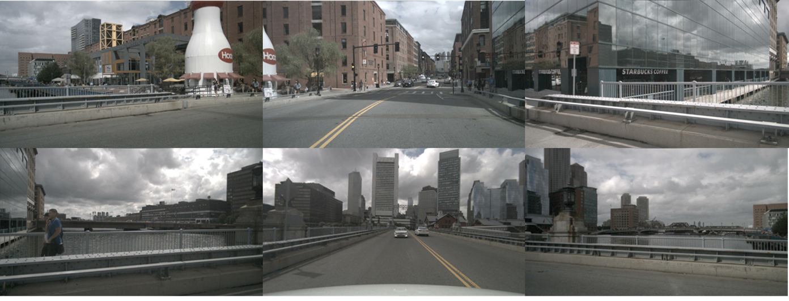
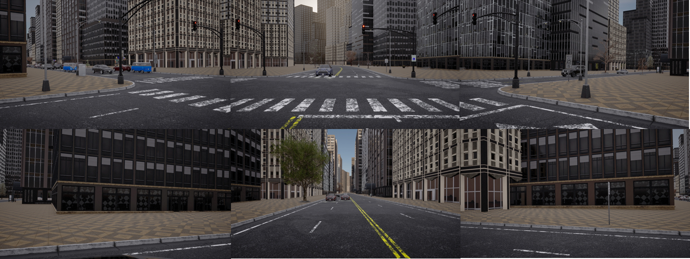

# Setup 
1. Clone This repository. 
1. Download CARLA pre-built package and additional maps. \
    You can use both Windows/Linux targets. \
    https://github.com/carla-simulator/carla/releases/tag/0.9.15/
1. Run setup/build_image.sh to build docker image. 
1. Run setup/run_container.sh to run the container. Parent directory where repository is cloned will be mounted as "/home/workspace" at container. 

Setup is verified only at WSL environment, but you can try to setup at Virtual Machine or Linux native environment. 

# Collect multi camera dataset
### 1. Setup the parameters which needed for data collection. 
- Set the parameter for SCENARIO_ROOT, SAVE_PATH in [collect_dataset.sh](common_library/agent_lib/collect_dataset.sh) as per your objective. 
- Set the parameter for HOST, PORT as per your CARLA environment. 
- "NUM_SCENES" should be set when you want to limit the number of xml file(exist at "carla_garage/data") executed for each scenarios. 

### 2. Execute data collection
- Start up CarlaUE4.exe. 
- Run [collect_dataset.sh](common_library/agent_lib/collect_dataset.sh). 

### 3. Dataset which you can generate
Using the repository, you can get, 
- Multi camera rgb images. 
- Lidar point cloud. 
- Semantic segmentation. 
- Depth image. 
- Bounding boxes. 
- Bev image. 
- Measurements data such as speed, yaw, control command, and etc...

You can configure camera parameters and what data will be saved at [config.py](common_library/common/config.py). 

Camera settings : GlobalConfig.cameras\
Generated data setting : 
```python
self.gen_bev_semantics = True
self.gen_boxes = False
self.gen_depth = False
self.gen_lidar = False
self.gen_rgb = True
self.gen_semantics = False
```
#### Generated multicamera images are demonstrated as below. 

[nuScenes]


[CARLA (generated using this repository)]
