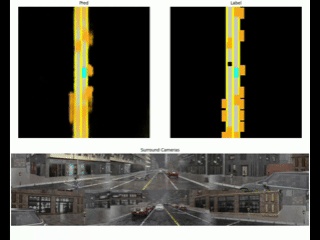

### Table of Contents
0. [Overview for the repository](#carla-ml-platform)
0. [Setup](#setup)
0. [Visualize BEV perception model](#visualize-bev-perception-model)
0. [Collect multi camera dataset](#collect-multi-camera-dataset)
0. [Train and Validate model](#train-and-validate-model)
0. [Future Works](#future-works)

# Carla ML Platform
### Overview

This repository is designed to generate autonomous driving datasets using the CARLA simulator and to train learning-based driving models on the generated data.  
Currently, a camera-only **bird's-eye-view(BEV)** perception model based on **Lift-Splat-Shoot (LSS)** is implemented, enabling training with a multi-camera dataset generated in CARLA.

### Key Contributions

The main contributions of this repository are as follows:

- Extension of **carla_garage** to support **multi-camera dataset collection**
- Porting the official **Lift-Splat-Shoot** implementation to enable training on simulator-generated data (Original model is trained only with nuScenes dataset)
- Decoupling data processing pipelines from model implementations, allowing easy extension to new model types

### What You Can Do with This Repository

- Generate a **multi-camera autonomous driving dataset** using **CARLA Leaderboard 2.0**
- Train and validate **BEV-based perception models**
- Analyze training behavior by plotting training and validation metrics
- Visualize BEV predictions from trained models

### References

For detailed explanations of dataset generation, model implementation, and training procedures, please refer to the following articles:

- https://qiita.com/Sugar-98 (Japanese)

# Setup 
1. Clone this repository. 
1. Download CARLA pre-built package and additional maps. \
    You can use both Windows/Linux targets. \
    https://github.com/carla-simulator/carla/releases/tag/0.9.15/
1. Run ["setup/build_image.sh"](setup/build_image.sh) to build docker image. 
1. Run ["setup/run_container.sh"](setup/run_container.sh) to run the container. Parent directory where repository is cloned will be mounted as /home/workspace at container. 

The setup has been verified on WSL2.It should also work on native Linux or virtual machines, although these environments are not officially tested.


# Visualize BEV perception model
You can visualize the BEV perception model (Lift Splat Shoot) using plotting script. 

1. Download pretrained model and lightweight dataset to visualization. 

    Pretrained models and dataset to visualization can be downloaded from below link: \
    https://drive.google.com/open?id=1VB3dpXXlhfrzJPJos8yYSB27bQd-PX6Z&usp=drive_fs

    Please download each file and extract it directly under the Carla_ML_Platform directory.


1. Set up path to dataset and pretrained models at ["LiftSplatShoot/Analysis/Visualize.sh"](LiftSplatShoot/Analysis/Visualize.sh)

    **data_path** : Path to dataset. \
    **pretrained_model_dir** : Path to pretrained model file. \
    **state_dict_file** : File name of state dictionary. \
    **save_path** : Save path where visualized video will be saved. 

    You can use environment variables defined at ["env.sh"](env.sh) to set up each path. 
1. Run visualization script ["LiftSplatShoot/Analysis/Visualize.sh"](LiftSplatShoot/Analysis/Visualize.sh). 

CAMERA data and BEV perception result demonstrated as below will be visualized by running the script. 



# Collect multi camera dataset
### 1. Setup the parameters which needed for data collection. 
- Set the parameter for SCENARIO_ROOT, SAVE_PATH in "common_library/agent_lib/collect_dataset.sh" as per your objective. 
- Set the parameter for HOST, PORT as per your CARLA environment. 
- "NUM_SCENES" should be set when you want to limit the number of xml file(exist at "carla_garage/data") executed for each scenarios. 

### 2. Execute data collection
- Start up CarlaUE4.exe. 
- Run "common_library/agent_lib/collect_dataset.sh". 

### 3. Dataset which you can generate
Using the repository, you can get, 
- Multi camera rgb images. 
- Lidar point cloud. 
- Semantic segmentation. 
- Depth image. 
- Bounding boxes. 
- Bev image. 
- Measurements data such as speed, yaw, control command, etc.

You can configure camera parameters and what data will be saved at "common_library/common/config.py". 
Camera settings : GlobalConfig.cameras\
Generated data setting : 
```python
self.gen_bev_semantics = True
self.gen_boxes = False
self.gen_depth = False
self.gen_lidar = False
self.gen_rgb = True
self.gen_semantics = False
```
#### Generated multicamera images are demonstrated as below. 

[nuScenes]\


[CARLA (generated using this repository)]\


# Train and Validate model
### 1. Setup training configuration. 

You can configure the training by set value for ["LiftSplatShoot/config_LSS.py"](LiftSplatShoot/config_LSS.py). 

### 2. Run train and validation script. 

Set up path to dataset and pretrained models at ["LiftSplatShoot/Train.sh"](LiftSplatShoot/Train.sh). If pretrained_model_dir is "", model will be trained from initial state. 

**data_path** : Path to dataset. \
**pretrained_model_dir** : Path to pretrained model file (Optional). \
**state_dict_file** : File name of state dictionary(Not referenced when pretrained_model_dir is ""). \
**model_save_dir** : Save path where trained model and log file will be saved. 

Training and Validation will start by running ["LiftSplatShoot/Train.sh"](LiftSplatShoot/Train.sh).

### 3. Analyze training results
After training is completed, the model checkpoint, logs, and configuration files are saved.
Visualization of the trained model itself is already described in [Visualize BEV perception model](#visualize-bev-perception-model).

To analyze training metrics, you can visualize the training logs using the provided plotting script ["LiftSplatShoot/Analysis/plot_train_log.py"](LiftSplatShoot/Analysis/plot_train_log.py).
This script reads the exported CSV log file and generates plots for each metric.

Run the following command:
```bash
python3 plot_log_csv.py --csv {path to log.csv} --outdir {path to output directory} --show
```
    

# Future Work

The following directions are planned as future extensions of this project:

- **Pretraining with open-source datasets**  
  Leverage large-scale public datasets such as nuScenes for pretraining to improve generalization and robustness.

- **Temporal modeling in BEV perception**  
  Incorporate temporal information into the BEV model to better capture motion cues and stabilize predictions over time.

- **End-to-end planning with a planning head**  
  Add a planning head to enable end-to-end execution of planning tasks from raw sensor data via learned latent representations.

- **Multi-task learning inspired by UniAD**  
  Extend the architecture with additional task heads following the UniAD framework, including tracking, map prediction, future trajectory prediction, occupancy prediction, and planning.